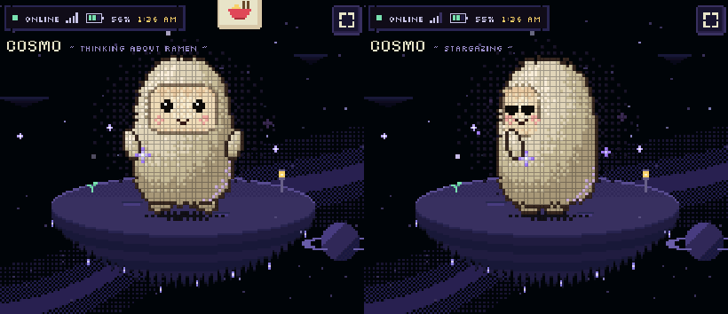
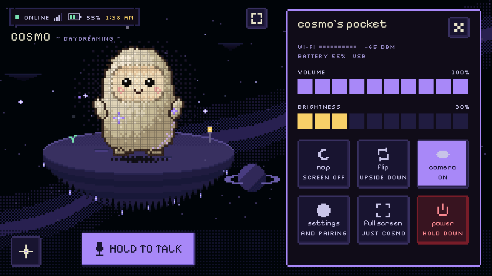
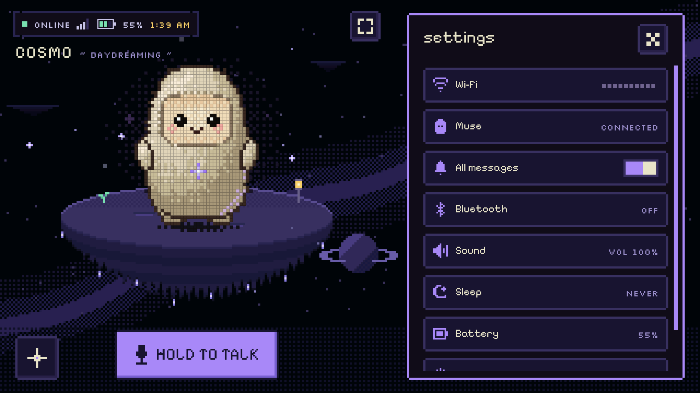
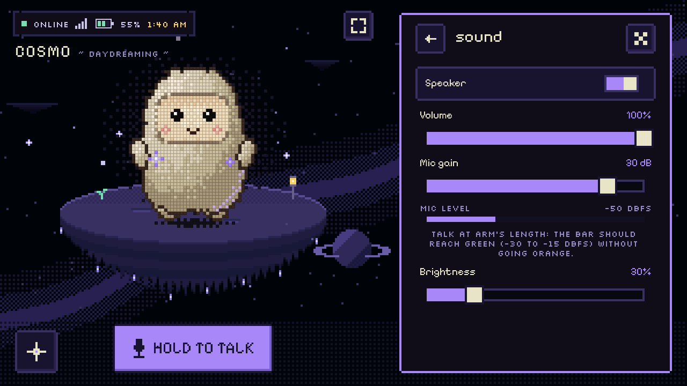
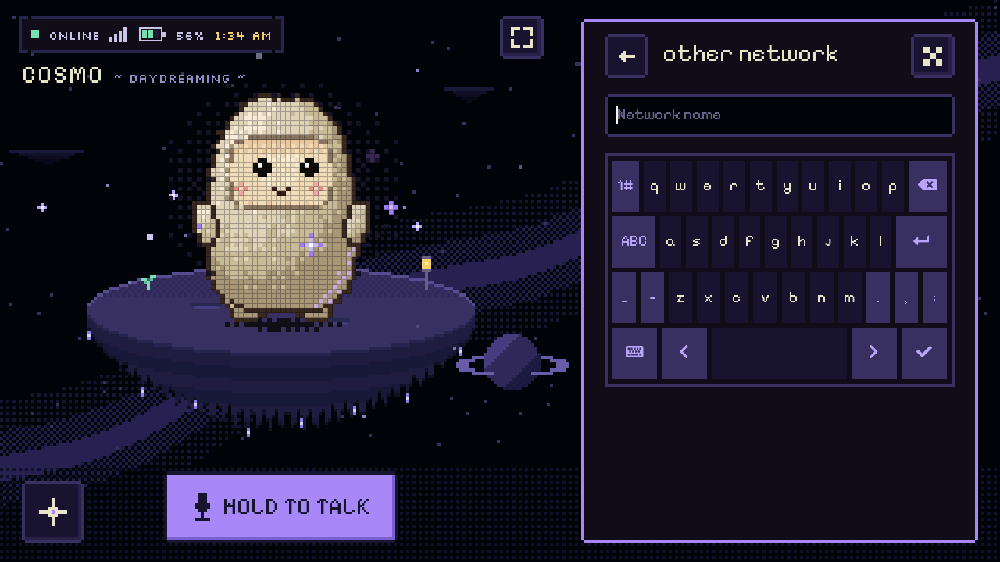
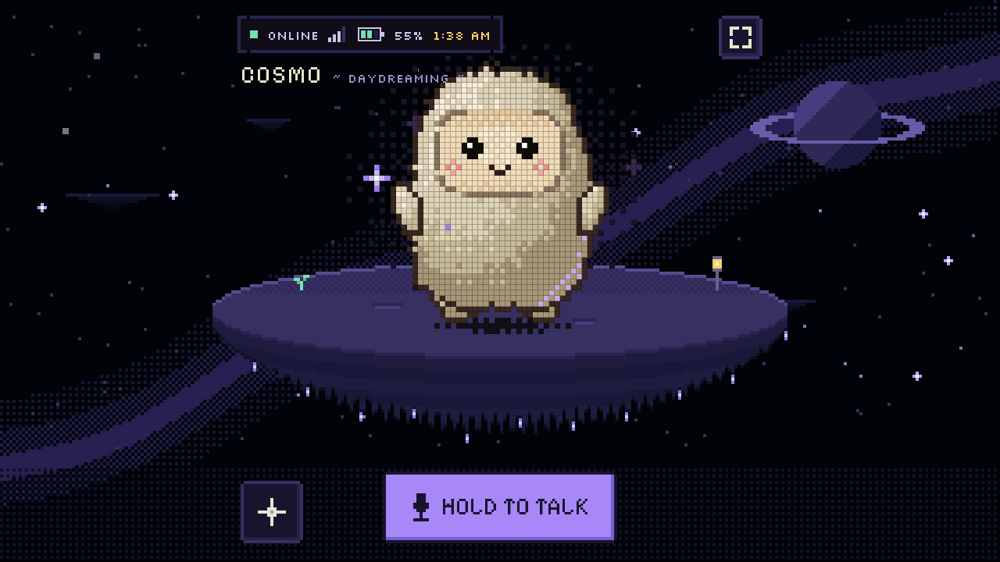

# Tab5 manual

How to use Muse on the M5Stack Tab5 with the pixel UI (kit test33 and
later). For building and flashing, see [README.md](README.md) and
[FLASHING.md](FLASHING.md).

## The screen

| Where | What |
|---|---|
| Top left | **Status strip**: Muse connection (green online, yellow connecting, red offline, "pairing"), Wi-Fi signal, battery (yellow while charging), a keyboard icon when the Tab5 Keyboard is attached, and the clock once it's set. |
| Under it | **Cosmo's name and mood**: what he's up to, from "daydreaming" and "out for a stroll" to "researching", "painting" or "all ears". |
| Middle | **Cosmo** on his island. |
| Top, by the island | **Full screen** button. |
| Bottom left | **✦ Pocket** button: quick controls. |
| Bottom | **Hold to talk**. It turns mint and says "listening…" while you hold it, and "thinking…" while Muse works. |
| Right | **Chat with Cosmo**. |

## Talking and typing

- **Talk**: hold *Hold to talk*, speak, let go. With the Tab5 Keyboard,
  hold **Tab** instead. Your spoken turn shows in the chat as a "voice note",
  and Cosmo's reply appears there and is spoken (see [KOKORO.md](KOKORO.md)).
- **Type**: tap *say something nice…* to open the on-screen keyboard, or type
  on the Tab5 Keyboard. **Enter** sends (or, with the line empty, confirms
  pairing when the Muse app asks for the press). **Esc** clears the line and
  closes the pocket or settings. **←/→** move the cursor, **↑/↓** scroll the
  chat.
- **Emoji**: the smiley button beside the line opens a picker.
- **Scroll** the chat by dragging it. The lavender bar on the right shows
  where you are.

## Cosmo

When nothing's going on, Cosmo doesn't just stand there. Every so often he
strolls about his island (he gets smaller as he goes further back and faces
where he walks), gazes up at the stars, looks around or daydreams in a
thought bubble. When a reply arrives he turns to look at the chat. Talking, a
reply or a reaction brings him straight home, facing you.

While Muse works, Cosmo shows what it's doing:

| Muse is… | Cosmo | Mood |
|---|---|---|
| Researching | reads an open book, a magnifier bobbing beside him | researching |
| Searching the web | a globe turns beside him | searching the web |
| Making an image | an easel, paint dabbing onto it | painting |
| Writing a reply | a little typewriter, notes floating up | writing back |
| Taking a photo | a camera to his face, a soft flash | taking a photo |

**Touch him**: shake the Tab5 and he gets dizzy; rub or tap his face quickly
and he giggles; drag up or down on him to change the volume. Before the
screen sleeps he yawns and dozes.

## The pocket

Tap **✦** (bottom left). Tap **✕** or **✦** again to close it.

- **Volume** and **brightness**: tap a cell.
- **Nap**: turns the screen off; a touch or a key wakes it.
- **Flip**: turns the picture upside down (and remembers it).
- **Camera**: on or off. While it's off Muse can't take photos. While Cosmo
  takes one, "snap!" shows over him.
- **Settings**: opens the settings window.
- **Full screen**: just Cosmo and his island.
- **Power**: hold it to switch the Tab5 off (on battery; on USB it stays on).
  Press the power button to turn it back on.

## Settings

From the pocket, **Settings** opens a window where the chat is. Tap a row
to open its page, **←** to go back (or swipe right), **✕** to close.

 

| Page | What's there |
|---|---|
| Wi-Fi | On/off, the connection, saved networks (tap one twice to forget it), scan, *Other network…* |
| Muse | Pairing state, the connection, server, VM ID, device token, *Test connection*, *Reset pairing* |
| All messages | On: messages Muse sends first, and replies to what you type in the Muse app, appear and are spoken here too |
| Bluetooth | Phone setup on/off, *Forget paired phones* |
| Sound | Speaker, volume, mic gain with a live level meter, brightness |
| Sleep | Turn the screen off after 30 s to 10 min idle, or never; *Sleep now* |
| Battery | Level and voltage, and a runtime measurement while on battery |
| Power off | Switch the Tab5 off |

Typing a Wi-Fi password or a network name opens a keyboard in the window.
With the Tab5 Keyboard attached, type on that instead (tap the field for the
on-screen one). **Show** reveals a password.

## Pictures from Muse

Ask Cosmo to show you something ("make a picture of a cat astronaut and put it
on my Tab5"). The Muse app asks you to approve the push. Once you do,
the picture appears over the scenery in a pixel polaroid frame. Tap it, or
start talking, to put it away.

## Photos

With the camera switched on in the pocket, ask Cosmo what he sees, or to
take a photo. He raises a camera, the screen flashes softly and "snap!"
shows while the Tab5 takes it.

## Full screen

**Full screen** (in the pocket, or the button by the island) hides the chat
and spreads the night sky across the whole screen. Tap the button again, or
start typing, to bring the chat back.

## The clock

The status strip shows the time once the Tab5 has set its clock over the
network, a few seconds after Wi-Fi connects. The time zone is a build option,
`CONFIG_MUSE_CLOCK_TZ` (see [README.md](README.md#build)).

## The bulletin board

The firmware carries a bulletin board for Muse: notes on what's new in the
build on the Tab5 and what's being worked on ([BULLETIN.md](BULLETIN.md)).
It works both ways:

- **Ask what's new**: "What's new on the Tab5?" or "What are we working on?"
  Muse reads the board (`bulletin.read`) and tells you.
- **Pin an idea**: "Pin an idea to the Tab5 board: …" Muse writes it down
  (`bulletin.post`). Ideas are kept on the Tab5 across restarts, 20 at most
  (the oldest go first), and come back whenever the board is read.
- **For the developer**: on the serial console, `>ideas` prints the pinned
  ideas and `>ideas.clear` prints them and takes them down. Update
  `tab5/BULLETIN.md` with each build so Muse's notes stay current.

## Troubleshooting

| Problem | Try |
|---|---|
| The Tab5 won't start after a flash, or keeps restarting in ROM | Unplug USB, hold the power button until it's off, then turn it on. Only a real power-off clears it. |
| "Muse didn't take it" in the chat | Muse's server didn't take the message (it sometimes answers an error after two minutes). Send it again. |
| A picture doesn't appear | Approve the push in the Muse app. If Muse didn't offer to push it, ask it to show the picture on the Tab5. |
| Wi-Fi drops or won't come back | Check Settings → Wi-Fi. Turning the camera off has helped before. A restart reconnects. |
| No spoken replies | Is the speaker on (pocket volume, Settings → Sound)? Is the Kokoro server running on your PC ([KOKORO.md](KOKORO.md))? |
| Cosmo says he can't reach Muse | Settings → Muse → *Test connection*. If it keeps failing, re-pair from the Muse app. |

## For developers: the serial console

Over USB (`tab5/tools/tab5_console.py --port COMx --send ">…"`):

| Line | Does |
|---|---|
| `>status` | Board, Wi-Fi, Muse, battery and settings as JSON |
| `>log` | The log since boot |
| `>chat=TEXT` | Sends TEXT to Muse as if typed |
| `>img=URL` | Shows a picture, as `display.draw_url` would |
| `>cam` | Takes a photo, as `camera.capture` would |
| `>wifi`, `>scan` | Wi-Fi state and recent drops; networks in range |
| `>ideas`, `>ideas.clear` | The bulletin board's pinned ideas |
| `>dock=…` | Shows the dock's states without touching the screen: `pocket`, `full`, `demo` (sample chat), `osk`, `walk`, `turn`, `think`, `work=research\|search\|write\|image\|camera\|none`, `settings`, `settings=home\|wifi\|muse\|ble\|sound\|sleep\|battery\|power\|text` |

`esp32/tools/muse/snap.py COMx ">dock=…" out.png` takes a screenshot (the
Tab5 build has `CONFIG_LV_USE_SNAPSHOT` on in its build directory).
