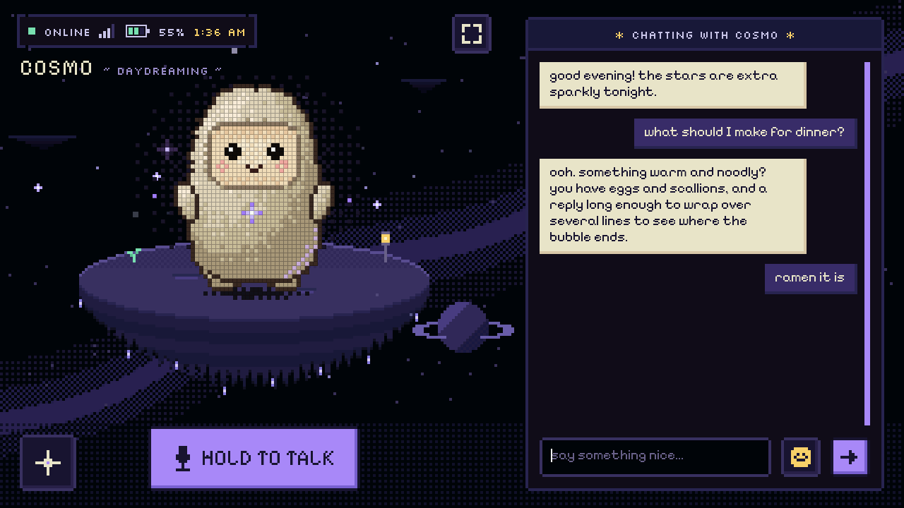
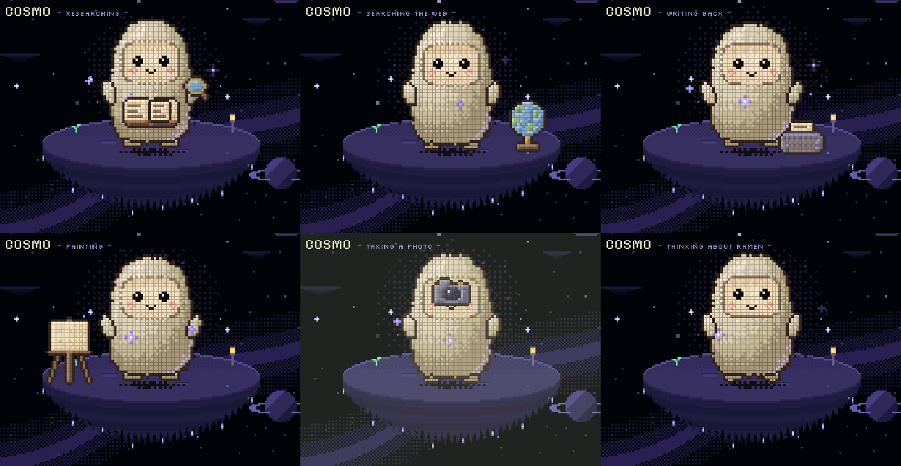

# Muse on the M5Stack Tab5 (experimental)

A port of the Muse gadget firmware ([`esp32/`](../esp32)) to the
[M5Stack Tab5](https://docs.m5stack.com/en/core/Tab5), redesigned around
**Cosmo**, the pixel-art avatar of the owner's Muse. Cosmo lives on a little
floating island in a night sky. Around him are a typed chat, hold-to-talk, a
pocket of quick controls and settings, all drawn in his own retro pixel style
on the Tab5's 5" 1280×720 touchscreen.



> **Status: in daily use on a Tab5 v1.3.** Pairing, Wi-Fi, the Muse
> connection, typed and spoken chat, spoken replies, touch, the keyboard, the
> camera, pictures from Muse, battery and the redesigned pixel UI are all
> working on hardware. See [CHANGELOG.md](CHANGELOG.md) for what changed and
> [NEXT-STEPS.md](NEXT-STEPS.md) for what's open.

This lives in a fork (`DCDominguez/muse-gadget-sdk`, branch `tab5-port`). It
isn't part of the upstream SDK; upstream pull requests need Meta's CLA (see
[`CONTRIBUTING.md`](../CONTRIBUTING.md)).

## What you get

| | |
|---|---|
| **Cosmo, alive** | He's see-through over the scenery. When he's idle he strolls about his island (smaller as he walks further back, facing where he goes), gazes at the stars, looks around and daydreams in thought bubbles. When a reply arrives he turns to look at the chat. All his original animations are still there: talking, listening, thinking, dizzy, sleepy, tickled. |
| **Work animations** | While Muse works, Cosmo shows what it's doing: a book and magnifier for research, a turning globe for a web search, an easel for an image, a typewriter while he writes back, a camera (with a soft flash) for a photo. These follow the activity Muse reports. |
| **Chat** | Type to Muse (on-screen keyboard or the Tab5 Keyboard), with replies streaming into cream bubbles, your spoken turns as "voice note" bubbles, an emoji picker and a pixel scrollbar. |
| **Pocket** | Volume and brightness, nap (screen off), flip, camera on/off, settings, full screen, power. |
| **Settings** | Wi-Fi, Muse, Bluetooth, sound, sleep, battery and power, in a pixel window beside Cosmo. |
| **Pictures** | Images Muse sends appear over the scenery in a pixel polaroid frame. |
| **Clock** | Set over the network, in your time zone. |
| **Bulletin board** | Notes built into the firmware tell Muse what's new and what's being worked on, and Muse can pin your ideas back to the board ([manual](MANUAL.md#the-bulletin-board)). |
| **Spoken replies** | Free with [Kokoro](KOKORO.md) on your PC, or with an ElevenLabs key. |



How to use all of it: **[MANUAL.md](MANUAL.md)**.

## Hardware notes

| | |
|---|---|
| SoC | ESP32-P4, **pre-v3 silicon** (the bring-up unit is v1.3). The build sets `CONFIG_ESP32P4_SELECTS_REV_LESS_V3`; ESP-IDF builds for v1.x and v3.x are mutually exclusive, so a v3.x Tab5 needs its own overlay. |
| Radio | None on the P4. Wi-Fi and BLE run on the on-board ESP32-C6 over 4-bit SDIO with `esp_hosted` 2.12 (host) and `esp_wifi_remote`; NimBLE stays on the P4. The C6 ships with esp_hosted slave 1.4.1. **This firmware never writes to the C6.** |
| Display | 720×1280 MIPI-DSI, run landscape. Three panel revisions (ILI9881C + GT911, ST7123, ST7121); Espressif's `m5stack_tab5` BSP tells them apart at start. The P4's PPA rotates each frame. Muse's own UI is a 720×600 box at the left, the dock fills the rest. |
| Audio | ES8388 speaker codec, ES7210 microphones. Default volume 30%. |
| Camera | SC202CS over MIPI-CSI (V4L2), cropped and scaled by the PPA, JPEG-encoded in hardware. Off until switched on in the pocket. |
| Motion | BMI270, for the shake reaction (Cosmo gets dizzy). |
| Power | INA226 at 0x41 (5 mΩ shunt), CHG_STAT on IO expander 0x44 pin 6, power-off by pulsing 0x44 pin 4 (all from M5Unified). |
| Keyboard | Tab5 Keyboard (A164) on Ext.Port1: I2C 0x6D, SDA G0, SCL G1, HID mode, polled. |

## Build

With ESP-IDF v6.0.1 (see [`esp32/AGENTS.md`](../esp32/AGENTS.md)):

```sh
cd esp32
tools/muse/board.sh build tab5          # -> build-muse-m5stack-tab5/
```

For a real device, set your SDK token in that build's `sdkconfig` first, as for
any board, or build a flashing kit instead (below), which keeps the token off
the build machine. Options worth knowing (`idf.py -B build-muse-m5stack-tab5
menuconfig`):

| Option | Default on the Tab5 | |
|---|---|---|
| `CONFIG_MUSE_PIXEL_THEME` | on | Cosmo's pixel look, fonts, scenery, wandering and work props |
| `CONFIG_MUSE_CLOCK_TZ` | `UTC0` | The clock's time zone as a POSIX TZ string, e.g. `JST-9` (UTC+9), `PST8PDT,M3.2.0,M11.1.0`; empty hides the clock |
| `CONFIG_HOMEHUB_BULLETIN` | on | The bulletin board (`bulletin.read`, `bulletin.post`) |
| `CONFIG_HOMEHUB_BULLETIN_FILE` | `../../tab5/BULLETIN.md` | The notes built into the firmware |

## Flash

See [`FLASHING.md`](FLASHING.md): back up first with
`tools/tab5-preflight.ps1`, build a kit with `tools/make_kit.sh`, put your token
in with the offline form, and flash with `tools/tab5-flash.ps1` (or hand
`tools/CODEX_PROMPT.md` to Codex). Kits flash the app only: pairing and Wi-Fi
survive.

## Files

| | |
|---|---|
| [`MANUAL.md`](MANUAL.md) | How to use the Tab5: the screen, chat, pocket, settings, camera, pictures, bulletin board, troubleshooting |
| [`CHANGELOG.md`](CHANGELOG.md) | What the port added and fixed, build by build |
| [`BULLETIN.md`](BULLETIN.md) | The notes Muse reads on the device (built into the firmware) |
| [`NEXT-STEPS.md`](NEXT-STEPS.md) | Where things stand and what's next |
| [`TESTING.md`](TESTING.md) | Every feature, how to try it, what the log says |
| [`FLASHING.md`](FLASHING.md) | Backup, kit, token, flash, boot log, rollback |
| [`KOKORO.md`](KOKORO.md) | Free spoken replies from a Kokoro server on your PC |
| [`BRIDGE.md`](BRIDGE.md) | Rules for an agent on the PC the Tab5 is plugged into |
| [`SDK-CHANGES.md`](SDK-CHANGES.md) | What the port changed outside its own board file |
| [`ROADMAP.md`](ROADMAP.md) | Longer-term plans |
| [`bringup-log.md`](bringup-log.md), [`plan.md`](plan.md), [`HANDOFF.md`](HANDOFF.md) | The bring-up record, the original plan and the latest handoff |
| `tools/` | Preflight backup, kit builder, flasher, offline token form, serial console |

In `esp32/`: the board is `components/muse/boards/board_m5stack_tab5.c` (camera
in `tab5_camera.c`), its overlay `devices/sdkconfig.muse-m5stack-tab5`, the
dock `components/muse/muse_dock.c`, the scenery `muse_scene.c`, the work props
`muse_props.c`, the shared pixel look `muse_pixel_style.h`, and the bulletin
board `main/bulletin.c`.

## Known issues

1. **ROM boot loop after some flashes.** Now and then the Tab5 loops in ROM
   after flashing (`rst:0x7`). Only a real power-off clears it: unplug USB,
   then hold the power button until it's off, and turn it back on.
2. **Pictures from Muse need your OK.** Each push to the Tab5 asks for
   approval in the Muse app, and Muse only pushes when asked (or when it
   offers). The bulletin board reminds it to offer.
3. **Muse's chat stream** sometimes answers HTTP 502 after two minutes (server
   side); the chat shows "Muse didn't take it". Try again.
4. **Wi-Fi settings show no MAC address**: the P4 has no Wi-Fi MAC of its own.
5. **Holding Tab to talk**: the keyboard reports releases without saying which
   key, so releasing any key ends the talk.
6. **USB presence** is inferred from charge current and the USB host; there's
   no VBUS sense. **Sleep** is backlight-off only.
7. **Windows host tests** fail on CRLF and temp-file cleanup; run them on
   Linux or macOS for a clean pass.
